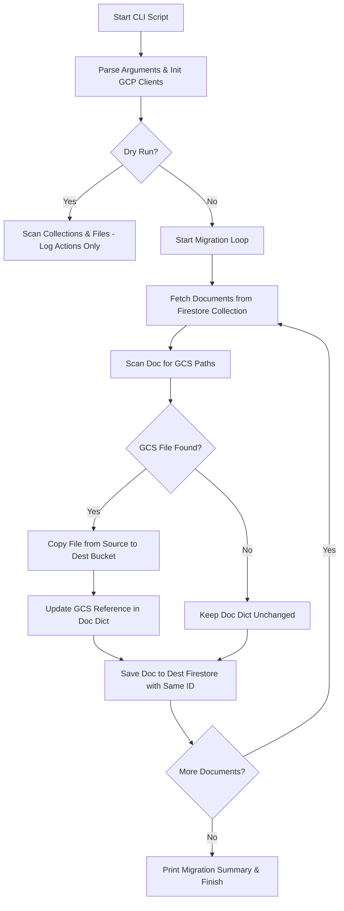

# Design Document: GCP Project Migration Utility

This document outlines the design for a command-line migration utility to move Firestore metadata and Google Cloud Storage (GCS) assets from a source GCP project to a destination GCP project.

---

## 1. Overview & Goal

The goal of this utility is to migrate all user-generated data, team configurations, and associated media assets from a source Google Cloud project to a destination Google Cloud project. To ensure zero disruption for users, any references to GCS paths (e.g., `gs://[source-bucket]/path`) stored inside Firestore documents must be updated dynamically during the migration to point to their new location (`gs://[dest-bucket]/path`).

---

## 2. Key Requirements

*   **Asset Migration (GCS):** Copy referenced files from the source bucket to the destination bucket, preserving the relative file paths.
*   **Metadata Migration (Firestore):** Migrate all documents across relevant collections, preserving their unique document IDs.
*   **Dynamic Reference Rewriting:** Scan document fields (including lists and nested maps) and rewrite GCS URIs from the source bucket to the destination bucket.
*   **Flexible Authentication:** Support standard Application Default Credentials (ADC) or separate Service Account JSON keys for the source and destination projects.
*   **Safety & Validation:**
    *   Implement a `--dry-run` mode to preview the migration (files to copy, documents to update) without executing writes.
    *   Avoid overwriting existing files in GCS or documents in Firestore unless a `--force` flag is supplied.
*   **Resiliency & Logging:** Provide detailed logs, progress indicators, and resume capability (skipping already migrated documents/files).

---

## 3. Data Structures & GCS Reference Mapping

As per requirements, the migration is strictly restricted to the `genmedia` collection and its sub-collections (excluding `teams`, `users`, VTO collections, etc.).

Below are the identified Firestore collections and fields containing GCS references that need migration:

| Collection | Field Name | Type | Description |
| :--- | :--- | :--- | :--- |
| `genmedia` (and sub-collections) | `gcsuri` | String | GCS URI of single generated media item (e.g. video, audio). |
| `genmedia` (and sub-collections) | `gcs_uris` | List of Strings | GCS URIs of batch-generated media items (e.g. images). |
| `genmedia` (and sub-collections) | `source_images_gcs` | List of Strings | GCS URIs of source input media. |
| `genmedia` (and sub-collections) | `source_uris` | List of Strings | GCS URIs of generic source/input media. |
| `genmedia` (and sub-collections) | `thumbnail_uri` | String | GCS URI of item thumbnails. |

> [!NOTE]
> To future-proof the tool against schema changes, we will implement a **generic recursive scanner** that inspects all string values in a document. Any string beginning with `gs://<source-bucket>/` will be automatically detected, the file copied, and the string updated. This will apply to the `genmedia` collection and all of its nested documents and sub-collections recursively.

---

## 4. Architecture of the CLI Tool

The tool will be written in Python as a standalone command-line script located at `utils/migration/migrate.py`.

### CLI Arguments & Options

```bash
uv run utils/migration/migrate.py \
  --source-project "source-project-id" \
  --dest-project "dest-project-id" \
  --source-bucket "source-assets-bucket" \
  --dest-bucket "dest-assets-bucket" \
  [--source-db "(default)"] \
  [--dest-db "(default)"] \
  [--source-credentials "/path/to/source-sa.json"] \
  [--dest-credentials "/path/to/dest-sa.json"] \
  [--collections "genmedia"] \
  [--dry-run] \
  [--force]
```

### Concrete Migration Command Example (Official Source)

To migrate from the official production source `vertex-creative-official` to your destination release-candidate project (e.g. `release-candidate-495709`):

```bash
uv run utils/migration/migrate.py \
  --source-project "vertex-creative-official" \
  --source-db "create-studio-asset-metadata" \
  --source-bucket "creative-studio-vertex-creative-official-assets" \
  --dest-project "release-candidate-495709" \
  --dest-db "(default)" \
  --dest-bucket "release-candidate-495709-assets" \
  --collections "genmedia" \
  --dry-run
```

### Script Execution Flow



---

## 5. Key Implementation Modules

### A. Client Initialization
Using separate credentials allows migrating across distinct organizations or identities:

```python
from google.cloud import firestore, storage
from google.oauth2 import service_account

def get_firestore_client(project_id, database_id, credentials_path=None):
    if credentials_path:
        creds = service_account.Credentials.from_service_account_file(credentials_path)
        return firestore.Client(project=project_id, database=database_id, credentials=creds)
    return firestore.Client(project=project_id, database=database_id)

def get_storage_client(project_id, credentials_path=None):
    if credentials_path:
        creds = service_account.Credentials.from_service_account_file(credentials_path)
        return storage.Client(project=project_id, credentials=creds)
    return storage.Client(project=project_id)
```

### B. Recursive Reference Rewriter & File Copier
The scanner recursively walks the dictionary of any Firestore document:

```python
def process_value(val, source_bucket, dest_bucket, storage_source, storage_dest, dry_run=False):
    if isinstance(val, str):
        if val.startswith(f"gs://{source_bucket}/"):
            relative_path = val[len(f"gs://{source_bucket}/"):]
            new_val = f"gs://{dest_bucket}/{relative_path}"
            
            # Perform GCS copy
            if not dry_run:
                copy_gcs_object(storage_source, source_bucket, storage_dest, dest_bucket, relative_path)
            
            return new_val
    elif isinstance(val, list):
        return [process_value(item, source_bucket, dest_bucket, storage_source, storage_dest, dry_run) for item in val]
    elif isinstance(val, dict):
        return {k: process_value(v, source_bucket, dest_bucket, storage_source, storage_dest, dry_run) for k, v in val.items()}
    return val
```

### C. Safe GCS Blob Copy
To save time and cost, the copy should check if the file already exists in the destination bucket:

```python
def copy_gcs_object(src_client, src_bucket_name, dest_client, dest_bucket_name, relative_path):
    src_bucket = src_client.bucket(src_bucket_name)
    src_blob = src_bucket.blob(relative_path)
    
    dest_bucket = dest_client.bucket(dest_bucket_name)
    dest_blob = dest_bucket.blob(relative_path)
    
    if dest_blob.exists():
        # Already copied, skip to prevent redundant egress/writes
        return
        
    # Download source to memory/temp and upload to dest
    # Or use direct GCS rewrite if across same org/accessible permissions
    with src_blob.open("rb") as f:
        dest_blob.upload_from_file(f, content_type=src_blob.content_type)
```

---

## 6. Next Steps & Actions

1.  **Approval:** Review this design.
2.  **Implementation:** Create the CLI script `utils/migration/migrate.py`.
3.  **Local/Dry Run Testing:** Test the script against sandbox projects/buckets.
4.  **Verification:** Confirm that migrated documents on the destination project match the source and work seamlessly in the deployed UI.
