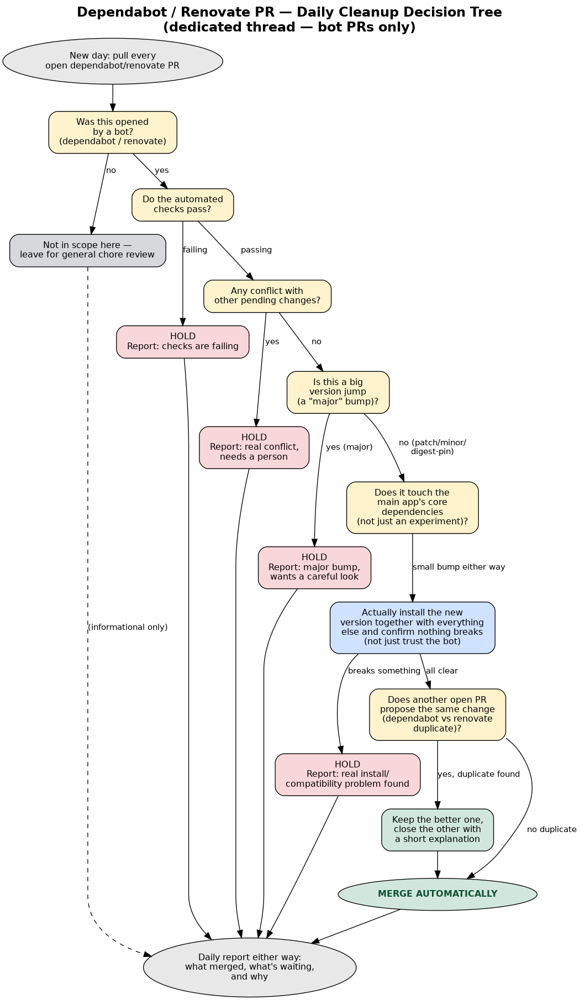

# Recurring Jobs

> **Purpose:** describe the three standing jobs that keep the repository current — what each
> does, how often it runs, whether it merges on its own or waits for sign-off, and exactly what
> it will and won't do without asking.

There are three recurring jobs. They look similar (all touch dependency and housekeeping PRs)
but they have **deliberately different authority**: one acts fully on its own, one acts on its
own for the safe cases only, and one never acts without an explicit go-ahead.

| Job | Cadence | Merges automatically? |
|---|---|---|
| [1. Fork Sync](#1-fork-sync) | Daily | **Yes** — it is a straight copy, no judgment call |
| [2. Bot-PR Cleanup](#2-dependabotrenovate-bot-pr-cleanup) | Daily | **Yes, for the safe ones only** — everything is reported either way |
| [3. General Chore / Dependency Review](#3-general-chore--dependency-pr-review) | Weekly / as-needed | **No** — always waits for the owner's sign-off |

---

## 1. Fork Sync

**What it does:** Every day, make the fork's `main` an exact mirror of upstream's `main`.

**Why:** So the fork never drifts out of date. Work is staged on the fork before it goes
upstream, so the fork's starting point must match upstream exactly.

**Cadence:** Daily. **Authority:** Fully automatic — no review.

### The normal case: fast-forward

A **fast-forward** is the simplest possible update: upstream has new commits, the fork has none
of its own, so the fork's `main` pointer simply slides forward to match upstream. Nothing is
rewritten and nothing can be lost. This is the expected case every day.

- If upstream has new commits the fork doesn't → pull them in (fast-forward) and push.
- If the fork already matches → do nothing.

In the fast-forward case the job **never** force-pushes and **never** rebases. It just moves the
pointer forward.

### The escalation rule (when it is *not* a clean fast-forward)

Before doing anything unusual, the job checks whether the fork's `main` has any **unique commits**
of its own — commits that exist on the fork but not upstream. In git terms this is the "ahead"
count.

| Situation | What it means | Action |
|---|---|---|
| **Ahead = 0**, but histories diverged | Upstream rewrote its own history (for example, a `git-filter-repo` scrub — see note below). The fork's `main` is a pure mirror with nothing unique to lose. | **Safe to force-resync** the fork's `main` to match upstream. |
| **Ahead > 0** | The fork's `main` has commits upstream doesn't — someone pushed directly to the fork's `main`, which shouldn't happen. | **STOP and escalate.** Do **not** force-push. Report the divergence and wait for a human decision. |

The key distinction: force-pushing is only ever acceptable when there is **provably nothing to
lose** (ahead = 0). If the fork's `main` holds unique work, that work could be destroyed by a
force-push, so the job refuses to guess and hands the decision to a person.

> **Why history can get "rewritten."** Upstream's history was scrubbed once (using a tool called
> `git-filter-repo`) to remove large legacy binaries and shrink the repository. A scrub rewrites
> every commit's identity, so afterwards the fork and upstream no longer share a common ancestor
> even though their *content* matches. That is the "ahead = 0 but diverged" case above, and it is
> safe to re-mirror.

**Scope note:** this job only syncs `main`. Feature branches (`feat/*`, `fix/*`, and so on) are
out of scope. If an upstream history rewrite happens, feature branches may separately need
attention — that gets flagged, not auto-handled.

**When you hear about it:** Only when something landed, or when something unusual happened
(the "ahead > 0" case). Silence means it worked and there was nothing to do.

---

## 2. Dependabot/Renovate Bot-PR Cleanup

**What it does:** Every day, look at every open pull request that was opened by an automated
**dependency bot** — Dependabot or Renovate — proposing to bump a library to a new version.
Decide, for each one, whether it is safe to merge right away or needs a human look first. Merge
the safe ones. Report everything, either way.

> **Dependabot / Renovate** are bots that watch your dependencies and automatically open a PR
> whenever a library you use publishes a new version. They are helpful but high-volume, and they
> only describe the change — they don't prove it actually works in *your* project.

**Why:** These pile up fast and are mostly harmless version bumps, but a few can quietly break
things in ways that don't surface until later. The goal is to clear the harmless ones without a
person reviewing each one, while still catching the ones that need judgment.

**Cadence:** Daily. **Authority:** Merges the safe ones automatically; holds and reports the rest.
This job handles **bot-authored PRs only** — human-written `chore(deps)` PRs are left for
[job #3](#3-general-chore--dependency-pr-review).

### The decision flow

The diagram below is the authoritative summary of this job's logic. The prose after it says the
same thing in words.

*(The diagram source is [`assets/repo-maintenance-decision-tree.dot`](./assets/repo-maintenance-decision-tree.dot).)*

**Merge automatically only if ALL of these are true:**

1. **It's a small version bump** — a patch, minor, or digest-pin bump, **not** a big jump to a
   new major version. (See the semver box below.)
2. **The automated checks pass.** One known exception: a Gemini auto-review check that times out
   at ~7 minutes is treated as noise, not a real failure — established project history.
3. **There's no real merge conflict.** (A "blocked, needs review" status is normal and expected;
   that's just branch protection, not a conflict.)
4. **The new version has been empirically verified** — the change was actually installed alongside
   everything else it depends on, and confirmed not to break. This step is not optional and is the
   subject of its own document: see **[verification-principle.md](./verification-principle.md)**.
5. **The blast radius is acceptable** — it affects a self-contained experiment, or it's a small
   bump even in the core app. Core-app dependency changes get extra scrutiny before merging.

**Hold for a human to look at if ANY of these are true:**

- It's a **major** version bump.
- It touches a core dependency of the main app in a way that isn't trivially small.
- The empirical install-and-check step finds a real problem.
- A check has a genuine failure (not the known auto-review timeout noise), or there's a real
  conflict.
- Two bots proposed the same change (see *Duplicates* below).
- **Anything else where confidence is low** — when in doubt, hold it and explain why, rather than
  guess.

> **Semver (semantic versioning)** labels a version as `MAJOR.MINOR.PATCH`, e.g. `8.6.2`.
> A **patch** (`8.6.2 → 8.6.3`) is a bug fix. A **minor** (`8.6 → 8.7`) adds features
> compatibly. A **major** (`8 → 9`) is allowed to break compatibility — which is why majors are
> always held for a human. A **digest-pin** bump repins to a new content hash (digest) of the
> same artifact with no version-number change (e.g. an internal Go module pin).

### Duplicates

If Dependabot and Renovate both propose the same dependency bump, keep the better/newer one and
close the other with a short explanatory comment (for example, *"Superseded by #N, which targets
the newer version"*). This is standing housekeeping — not something to ask about each time — but
it is always called out plainly in the report.

**When you hear about it:** A daily note listing what merged automatically (with details) and
what's waiting on a human, with a plain reason for each held item. The report is written every
run, even when there's nothing open.

---

## 3. General Chore / Dependency PR Review

**What it does:** A broader sweep that also includes **human-authored** chore PRs — dependency
cleanups, minor housekeeping — not just bot bumps. It produces a risk assessment grouped into
"waves" and requests sign-off. Unlike job #2, **it never merges anything by itself.**

**Why:** Human-authored chores are less predictable than bot bumps. A person might be mid-way
through something, or have context the automation doesn't. So this job stays approval-only.

**Cadence:** Weekly, or as needed. **Authority:** Read-only assessment — never merges, closes,
comments on, or modifies any PR. It reports and waits.

### The waved risk assessment

Each open chore/dependency PR is analyzed for: what's changing (package, from→to version, semver
class), its blast radius (core app vs. an experiment vs. CI config), CI status, mergeability, and
whether it's a security fix. The PRs are then grouped into waves so the owner can approve them in
order of risk:

| Wave | Meaning | Example contents |
|---|---|---|
| **Wave 1 — safe, merge now** | Low-risk patch/minor bumps in experiments or docs, green CI. | Small bumps with no plausible downside. |
| **Wave 2 — verify first** | Security-relevant or core-app minor bumps that need the empirical check before merge. | A minor bump to a core library. |
| **Wave 3 — one at a time** | Major version bumps and CI-action majors, each merged and tested individually. | A jump to a new major version. |
| **Hold / close** | Abandoned, superseded, conflicting, or failing-check PRs. The blocker is named. | A PR whose check genuinely fails. |

The report also notes the **delta since the previous run** (new PRs, ones merged or closed,
changed CI status), so the owner isn't re-reading unchanged items.

**When you hear about it:** A report whenever there's something to review — a headline table, the
waves, the top risks, and anything needing a decision — **explicitly requesting sign-off** on
which waves to execute. Nothing moves until the owner says go.

---

## At a glance

| | Fork Sync | Bot-PR Cleanup | General Chore Review |
|---|---|---|---|
| **Cadence** | Daily | Daily | Weekly / as-needed |
| **Scope** | Fork `main` only | Bot-authored PRs only | Bot **and** human chore PRs |
| **Merges automatically?** | Yes (pure copy) | Safe ones only | No — sign-off required |
| **Empirical verify step?** | N/A | Yes, before every merge | Yes, before recommending |
| **You hear from it when** | Something landed, or divergence | Daily, always | When there's something to review |

For *why* the empirical verify step matters — and the real breakage it has caught — continue to
**[verification-principle.md](./verification-principle.md)**.
