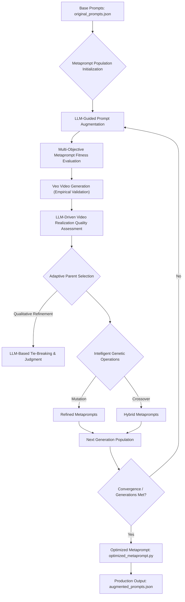

# Veo Genetic Prompt Optimizer

An evolutionary prompt engineering pipeline that automatically discovers, evolves, and optimizes metaprompts for Google's Veo video generation models using Gemini 3.6 Flash as an LLM-in-the-loop judge, mutator, and evaluator.

---

## Features

- **Multi-Objective Fitness Evaluation**: Assesses candidate metaprompts across instructional efficacy, prompt richness, and user intent fidelity.
- **Multimodal Support**: Supports text-to-video and image-to-video prompt optimization with automatic aspect ratio detection (`16:9` vs `9:16`).
- **Safety Sanitization**: Automated policy sanitization ensuring prompts comply with generative AI safety guidelines (e.g., minor reference removal while preserving scene composition).
- **Closed-Loop Video Feedback**: Evaluates generated Veo video pairs with positional bias counteraction (`flip_enabled`) and passes qualitative feedback into downstream genetic operations.
- **Resilient Pipeline**: Thread-safe evaluation, exponential backoff for quota management, and fallback heuristics for continuous evolutionary search.

---

## Quickstart

### 1. Installation

Prerequisites: **Python >= 3.12** and [Google Cloud CLI (`gcloud`)](https://cloud.google.com/sdk/docs/install).

```bash
# Navigate to the experiment directory
cd experiments/veo-genetic-prompt-optimizer

# Install dependencies using uv (recommended), poetry, or pip
uv sync

# Or with pip:
pip install -e .
```

### 2. Configuration

Copy the example environment file and configure your Google Cloud project settings:

```bash
cp .env.example .env
```

Edit `.env` with your project parameters:

```env
PROJECT_ID="your-gcp-project-id"
GEMINI_MODEL_ID="gemini-3.6-flash"
LOCATION="global"
AUTORATER_MODEL_ID="gemini-3.6-flash"
AUTORATER_LOCATION="global"
VEO_MODEL_ID="veo-3.1-fast-generate-001"
VEO_LOCATION="us-central1"
```

Authenticate with Google Cloud Application Default Credentials:

```bash
gcloud auth application-default login
```

---

## Usage

### 1. Run the Metaprompt Optimizer

Evolve a population of candidate metaprompts against a dataset of base prompts:

```bash
python -m veo_genetic_prompt_optimizer.prompt_optimizer \
  --generations 5 \
  --population-size 10 \
  --top-k 2 \
  --prompts original_prompts.json \
  --output-metaprompt optimized_metaprompt.py \
  --history optimization_history.json
```

### 2. Generate Augmented Prompts

Use the best-evolved metaprompt to augment and sanitize a batch of prompts:

```bash
python -m veo_genetic_prompt_optimizer.generate_prompts \
  --history optimization_history.json \
  --prompts original_prompts.json \
  --output augmented_prompts.json
```

### 3. Generate Videos (Optional)

Generate video pairs (original vs. augmented) via the Vertex AI Veo API:

```bash
python -m veo_genetic_prompt_optimizer.generate_videos \
  --prompts augmented_prompts.json \
  --output-dir video_pairs \
  --max-workers 4
```

### 4. Evaluate Video Pairs

Compare generated video pairs using Gemini with positional order flipping:

```bash
python -m veo_genetic_prompt_optimizer.evaluate_videos \
  --prompts augmented_prompts.json \
  --video-dir video_pairs \
  --sampling-count 4 \
  --flip
```

### 5. Run Full Pipeline End-to-End

Execute all stages in sequence (optimizer → prompt generation → video generation → evaluation):

```bash
# Run full pipeline skipping video generation (dry prompt run)
python -m veo_genetic_prompt_optimizer.run_pipeline --skip-videos

# Or run complete pipeline with video generation
python -m veo_genetic_prompt_optimizer.run_pipeline
```

---

## Testing & Validation

### Offline Automated Tests (Zero API Cost)

Run the automated test suite covering unit logic, genetic operators, scoring aggregation, and full pipeline execution:

```bash
pytest tests/
```

### Smoke Test Suite

Validate environment configuration, model connectivity, and micro-optimization:

```bash
# 1. Offline dry-run check (verifies environment and runs test suite)
python smoke_test.py --dry-run

# 2. Live smoke test against Gemini 3.6 Flash in the global region
python smoke_test.py

# 3. Live smoke test with 1 Veo video generation test
python smoke_test.py --test-video
```

---

## Pipeline Architecture



### Phase Breakdown

1. **Phase 1: Population Initialization**: Seeds candidate solutions from `original_metaprompt` using Gemini to create diverse initial variations.
2. **Phase 2: Prompt Augmentation**: Transforms raw base prompts into detailed Veo prompt candidates guided by `veo_guide.md`.
3. **Phase 3: Multi-Objective Fitness Evaluation**:
   - **Instructional Efficacy** (weight: 0.3): Pointwise evaluation of the candidate metaprompt.
   - **Augmented Prompt Quality** (weight: 0.4): Richness of camera motion, lighting, and detail.
   - **Intent Preservation** (weight: 0.3): Faithfulness to the original user query and reference image.
4. **Phase 4: Empirical Veo Video Generation**: Renders video outputs via the Vertex AI Veo API (supporting text-to-video and image-to-video).
5. **Phase 5: Video Realization Quality Assessment**: Performs pairwise video comparisons using Gemini with order flipping (`flip_enabled`) to counteract positional bias.
6. **Phase 6: Selection & Reproduction**: Elitism preserves top performers; mutation and crossover synthesize feedback to generate subsequent generations.

---

## Configuration Reference

| Environment Variable | Default | Description |
| :--- | :--- | :--- |
| `PROJECT_ID` | *Required* | Google Cloud Project ID |
| `GEMINI_MODEL_ID` | `gemini-3.6-flash` | Gemini model for prompt generation, mutation, and tie-breaking |
| `LOCATION` | `global` | Region for Gemini API endpoints |
| `AUTORATER_MODEL_ID`| `gemini-3.6-flash` | Gemini model for evaluation scoring |
| `AUTORATER_LOCATION`| `global` | Region for autorater evaluation tasks |
| `VEO_MODEL_ID` | `veo-3.1-fast-generate-001` | Veo model ID for video generation |
| `VEO_LOCATION` | `us-central1` | Region for Veo video generation endpoints |
| `NUM_GENERATIONS` | `5` | Default number of evolutionary generations |
| `POPULATION_SIZE` | `10` | Number of candidate metaprompts per generation |
| `TOP_K_SELECTION` | `2` | Number of elite parents selected per generation |
| `ENABLE_VIDEO_FEEDBACK`| `false` | Enable closed-loop video evaluation during GA run |

---

## Contributing

1. Check existing issues or create a new issue for proposed updates using `bd create`.
2. Ensure all tests pass before submitting changes:
   ```bash
   pytest tests/
   ```
3. Follow repository conventions in `AGENTS.md`.

---

## License

This experiment is part of the Vertex AI Creative Studio and is licensed under the **Apache-2.0 License**.
