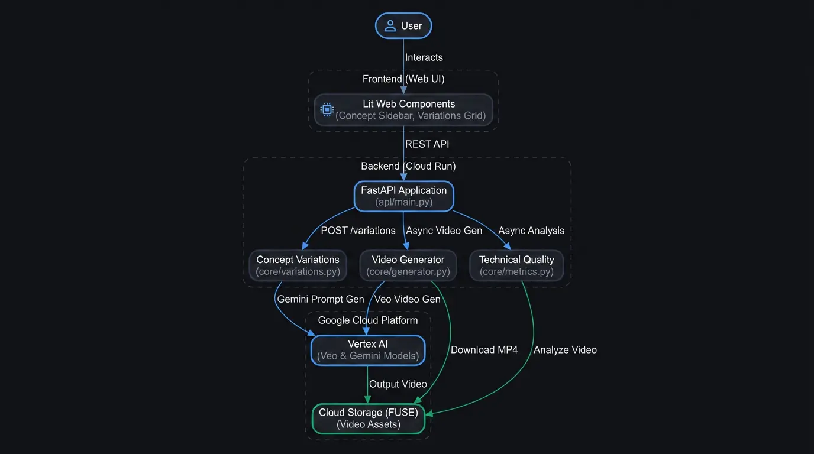

# Veo Variations Experiment Guide

This application generates creative variations of a video concept and evaluates them technically using Nano Banana, Gemini, and Veo 3.1 Lite.


## Architecture



## Project Structure

- **api/main.py**: FastAPI backend that orchestrates the workflow.
- **core/**: Core logic for generation and analysis.
  - **generator.py**: Veo video generation using the GenAI SDK.
  - **variations.py**: Prompt variation generation using Gemini.
  - **metrics.py**: Technical quality evaluation (NIQE) using pyiqa.
  - **c2pa.py**: C2PA manifest extraction and summarization.
- **ui/**: Lit-based frontend (TypeScript).
- **scripts/deploy.sh**: Deployment script for Google Cloud Run.
- **Makefile**: Shortcut commands for local development and build.

## Development Workflow

### Local Development

1. **Install dependencies:**
   ```bash
   make install
   ```
2. **Setup environment:**
   Create a .env file from .env.template and edit it with your project details.
   ```bash
   cp .env.template .env
   ```
3. **Start the API:**
   ```bash
   make api
   ```
4. **Start the Frontend (Dev mode):**
   In a separate terminal:
   ```bash
   make ui
   ```

### Makefile Commands

- make install: Installs both Python and Node.js dependencies.
- make build: Builds the production UI bundle into ui/dist.
- make api: Runs the backend with hot-reload enabled.
- make ui: Runs the Vite dev server for the UI.
- make clean: Removes temporary files and build artifacts.

## Deployment

The application is designed to run on **Google Cloud Run** with **Cloud Storage FUSE** for persistent video storage.

### 1. Environment Configuration
The deployment script (`scripts/deploy.sh`) automatically reads configuration from your `.env` file at the root of the project. Ensure the following variables are properly set in your `.env` file before deploying:
- `VEO_PROJECT_ID`: Your Google Cloud Project ID.
- `VEO_LOCATION`: Your desired deployment region (e.g., `us-central1`).
- `VEO_BUCKET`: The GCS bucket name for storing generated videos (e.g., `gs://your-bucket`).

If you wish to deploy the application with Identity-Aware Proxy (IAP) protection, set `USE_IAP=true` and provide an `EAP_GROUP` (e.g., `EAP_GROUP=my-team@example.com`) either in the `.env` file or as environment variables when running the script. By default, the application is deployed with public access (`--allow-unauthenticated`).

### 2. Build the Production UI
Before deploying, you must build the frontend so it can be served as static files by the backend:
```bash
make build
```

### 3. Run the Deployment Script
```bash
bash scripts/deploy.sh
```

**Note:** The script will:
- Create a dedicated service account if it doesn't exist.
- Grant necessary permissions (aiplatform.user, storage.objectAdmin).
- Build and push the container image to GCR.
- Deploy to Cloud Run with IAP protection and GCS FUSE mounting.

## Key Features

- **Concurrent Generation**: Generates multiple video variations in parallel.
- **Technical Analysis**: Automatically calculates NIQE scores for generated videos.
- **C2PA Integration**: Verifies and summarizes content credentials.
- **Cloud Run + FUSE**: Scalable deployment with direct file-system access to GCS.
